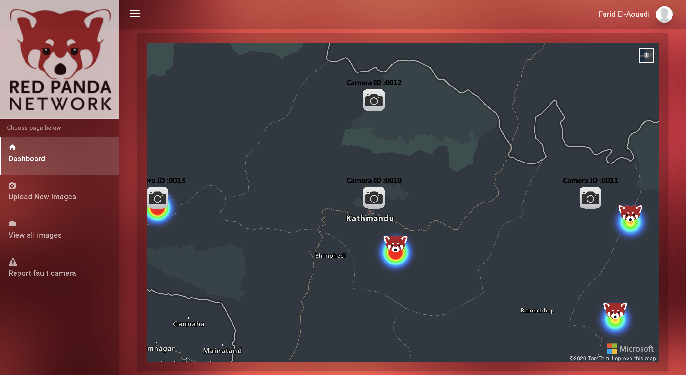

Background
----------
- Project 15​ from Microsoft is on a mission to accelerate innovation in environmental conservation and ecological sustainability. Cloud computing, Internet of Things (IoT) and Artificial Intelligence (AI) bring great opportunity to drive advancements in a myriad of sustainability efforts including preserving biodiversity and protecting critical habitat.

- As part of the UCL IXN, I had the opportunity to work alongside Microsoft to create a web app for the "Red Panda Network" to streamline major ineffeciencies in their workflow. 

Current Progress
----------------

- User Authentication using Azure Active Directory
- Web App Design adhering to Don Norman's design principles and Preece's Interaction design principles
- Azure map with clickable icons for camera traps 
- Web scraper to gather training data for red panda classifier (scrape.py)
- Red panda classifier using https://www.customvision.ai/ and script for inference
- Web app hosted on Azure using Azure app service (https://redpandanetwork.azurewebsites.net/)
- CI/CD workflow using Github and Azure Pipelines 

Backlog 
--------
- Upload new images using Azure blob storage
- API to retrieve data for each camera 
- Unit tests using Pytest and Selenium
- Code Refactoring
- Meeting with Red panda network

Extra
-----

Full Video demonstration : (Coming soon)
